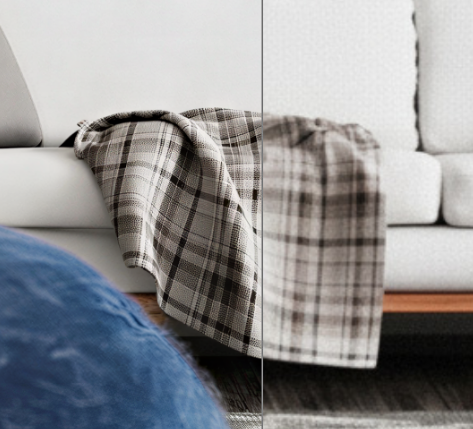
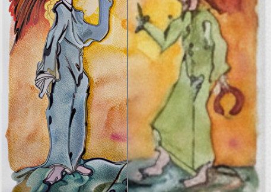
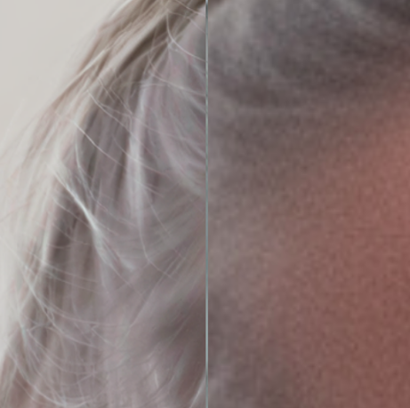
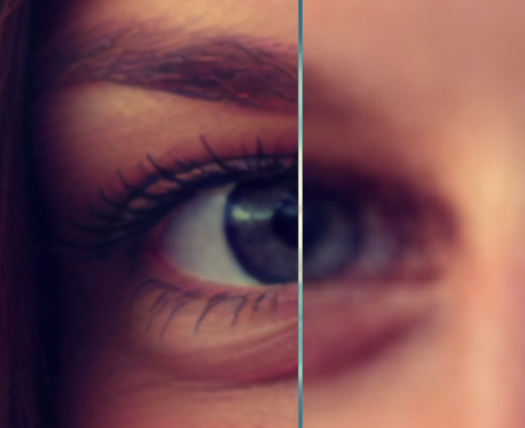

# SeedVR2 Tiling Upscaler

A ComfyUI custom node for memory-efficient image upscaling using SeedVR2 models with advanced tiling and detail-preserving stitching.

> **Note**: This node is based on and compatible with the **latest nightly build** of the [ComfyUI-SeedVR2_VideoUpscaler](https://github.com/numz/ComfyUI-SeedVR2_VideoUpscaler) node pack. It supports all advanced features including the new `SeedVR2ExtraArgs` node for enhanced control over memory management and processing options.

WARNING: This is not magic - although it sometimes may seem that way. It will alter details and it might even change things you don't like. But in my testing the outputs are more convincing than any other detailer / upscaler processes I tested so far. Personally, I use it to refine Flux / ... outputs and enhance skin detail (or any detail) for further, more natural looking training datasets. Upscaling for print use is also one way to use this.

The stitching code is not optimal. You will get the best results by using the tile_width & tile_height of "512" with no (0.0) anti_aliasing_strength and a padding of "32" / "64", also no mask_blur to get multi-band frequency separation. I upscaled to images beyond 10k and it worked fine.

## Example upscales

 




## Features

- **Advanced Multi-Band Blending**: Frequency-separated processing eliminates seams while preserving detail
- **Content-Aware Stitching**: Adaptive blending based on local image structure and edge strength
- **Edge-Preserving Smoothing**: Bilateral filtering reduces artifacts without destroying fine details
- **Memory Optimized**: Prevents OOM errors using configurable tile-based upscaling
- **SeedVR2 Integration**: Works with SeedVR2 stable releases and nightly builds (3B/7B, FP16/FP8, sharp, GGUF)
- **Advanced Tiling**: Linear and Chess tiling strategies with configurable overlap

## Compatibility & Model Discovery

**Based on SeedVR2 Nightly Build**: This node is designed to work with the latest nightly version of the SeedVR2 node pack and supports all its advanced features.

- **Dynamic model list**: Available models are pulled from seedvr2 node when the nightly package is installed. Main (stable) version keeps the predefined models list.
- **GGUF support**: SeedVR2 nightly supports GGUF models, these are now selectable in the dropdown once they are downloaded or discovered on disk.
- **Backward compatibility**: Works with both stable and nightly SeedVR2 builds through automatic API detection.
- **Extra Args support**: Connect the `SeedVR2ExtraArgs` node (from nightly) for advanced options like `preserve_vram`, `tiled_vae`, `cache_model`, `enable_debug`, and device selection.

## How It Works

1. Input image is divided into overlapping tiles
2. Each tile is upscaled using SeedVR2 to a fixed resolution
3. Upscaled tiles are resized to their final target dimensions
4. **Advanced Multi-Band Stitching**: 
   - **Zero-blur mode**: Frequency-separated blending preserves fine details while eliminating seams
   - **Content-aware mode**: Structure-adaptive blending with edge-preserving smoothing
   - **Bilateral filtering**: Reduces artifacts without destroying texture details

## A personal suggestion

I also included example workflows (in the 'workflows' directory). Use the the advanced workflow for even better outputs. This one will do a first pass with the regular SeedVR2 node and then pass that output to a second pass, which does the tiled upscaling. The advanced workflow uses one of my other nodes from the "moonpack" (ProportionalDimension, https://github.com/moonwhaler/comfyui-moonpack).

### But why?

A little "trick" is to downscale the image (yes, we degrade quality at first) and add static noise (which provides variance when upscaling). After that the upscale is able to "create" finer details. The downside is that the original image is altered more. You can play around with this using the provided "switches" in the advanced workflow (less downscale, less new details, but more true to the original image - add more noise to get more variance in finer parts of the image). If you have text in an image and want to preserve it, you should go for a very low downscale factor!

In my tests the results were sometimes exceptional, sometimes "meh", depending on what I wanted to get (illustrations, portraits etc.). This also depends on the seed. I suggest using a random one to get slightly altered outputs - or a fixed one to compare changes. 

## Installation

### Prerequisites

- ComfyUI installed and working
- SeedVR2 models and nodes from https://github.com/numz/ComfyUI-SeedVR2_VideoUpscaler installed in ComfyUI
- If you want to use the advanced workflow, you might need to install KJNodes, too. (https://github.com/kijai/ComfyUI-KJNodes)

### Install the Node (ComfyUI-Manager)

If you're using the ComfyUI-Manager extension, you can also install this node there.

### Install the Node (manually)

1. Clone this repository to your ComfyUI custom nodes directory:
```bash
cd ComfyUI/custom_nodes/
git clone https://github.com/moonwhaler/comfyui-seedvr2-tilingupscaler.git
```

2. Install dependencies (outside of ComfyUI):

**IMPORTANT**: The requirements must be installed in the same Python environment that ComfyUI uses. This is typically a virtual environment (venv) or conda environment.

**For venv users:**
```bash
# Activate your ComfyUI virtual environment first
source /path/to/your/comfyui/venv/bin/activate  # Linux/Mac
# OR
/path/to/your/comfyui/venv/Scripts/activate  # Windows

# Then install requirements
cd UltimateResupscaler
pip install -r requirements.txt
```

**For conda users:**
```bash
# Activate your ComfyUI conda environment first
conda activate your-comfyui-environment

# Then install requirements
cd UltimateResupscaler
pip install -r requirements.txt
```

**For portable ComfyUI installations:**
```bash
# Use the Python executable from your ComfyUI installation
cd UltimateResupscaler
/path/to/ComfyUI/python_embeded/python.exe -m pip install -r requirements.txt  # Windows
# OR
/path/to/ComfyUI/python/bin/python -m pip install -r requirements.txt  # Linux/Mac
```

**Note**: Do NOT install these requirements in your system Python or a different environment, as ComfyUI will not be able to find them.

3. Restart ComfyUI

The node will appear in the `image/upscaling` category as "SeedVR2 Tiling Upscaler".

## Requirements

### System Requirements
- Python 3.10+
- CUDA-capable GPU (recommended)
- Sufficient RAM/VRAM for chosen tile upscale resolution

### Dependencies
- torch>=1.9.0
- torchvision>=0.10.0
- numpy>=1.21.0
- Pillow>=8.0.0
- scipy>=1.7.0
- scikit-image>=0.19.0 (optional, for advanced blending)
- opencv-python>=4.5.0 (optional, for edge-preserving smoothing)
- SeedVR2 node (installed separately)

## Usage

### Basic Usage
1. Add the "SeedVR2 Tiling Upscaler" node to your ComfyUI workflow
2. Connect your input image
3. Select your desired SeedVR2 model
4. Configure parameters
5. Run the workflow

### Advanced Usage with Extra Args (Nightly)
For access to advanced memory management and processing options:
1. Add the `SeedVR2ExtraArgs` node (from the nightly SeedVR2 node pack)
2. Configure advanced options like `preserve_vram`, `tiled_vae`, `cache_model`, etc.
3. Connect the output of `SeedVR2ExtraArgs` to the `extra_args` input of the Tiling Upscaler
4. Optionally add `SeedVR2 BlockSwap Config` and connect to `block_swap_config` for additional VRAM management

This modular approach allows you to use the basic node without any extra configuration, or connect additional nodes for fine-grained control.

## Parameters

### Core Settings
- **model**: SeedVR2 model to use for upscaling
- **seed**: Random seed for reproducible results
- **new_resolution**: Target resolution for the longest side of the output image

### Optional Inputs
- **block_swap_config**: Connect the `SeedVR2 BlockSwap Config` node for advanced VRAM management
- **extra_args**: Connect the `SeedVR2ExtraArgs` node (from nightly) for advanced options:
  - `preserve_vram`: Enable VRAM optimization by offloading models between steps
  - `tiled_vae`: Enable tiled VAE processing for extreme memory savings
  - `vae_tile_size` / `vae_tile_overlap`: Control VAE tiling behavior
  - `cache_model`: Keep models in RAM between runs for faster batch processing
  - `enable_debug`: Show detailed memory usage and timing information
  - `device`: Select which GPU to use for processing

### Memory Management
- **tile_upscale_resolution**: Maximum resolution for individual tile upscaling
  - Lower values = less memory usage, faster processing
  - Higher values = better quality, more memory usage
  - Recommended: 1024-2048 depending on VRAM

### Tiling Configuration
- **tile_width/height**: Size of each tile in pixels (default: 512x512)
- **tile_padding**: Overlap between tiles in pixels (default: 32)
- **tiling_strategy**: 
  - **Linear**: Process tiles row by row
  - **Chess**: Process tiles in checkerboard pattern for better blending

### Detail Preservation
- **mask_blur**: Blending control for tile edges (default: 0)
  - **0**: Zero-blur mode - Maximum detail preservation through pixel averaging
  - **1-3**: Smart minimal blur - Hides seams while preserving details
  - **4+**: Traditional blur - Smoother blending with some detail loss

## Recommended Settings

### Maximum Detail Preservation  
- **mask_blur**: 0 (multi-band frequency separation)
- **tile_padding**: 64 pixels (more overlap for better blending)
- **tile_upscale_resolution**: Highest your VRAM allows
- **anti_aliasing_strength**: 0.2 (subtle smoothing)

### Balanced Quality & Speed
- **mask_blur**: 2 (content-aware blending with bilateral filtering)
- **tile_padding**: 32 pixels  
- **tile_upscale_resolution**: 1024-1536
- **anti_aliasing_strength**: 0.1

### Fast Processing
- **mask_blur**: 1 (lightweight edge-preserving blend)
- **tile_padding**: 16 pixels
- **tiling_strategy**: Linear
- **anti_aliasing_strength**: 0.0

## Troubleshooting

### OOM Errors
- Reduce `tile_upscale_resolution`
- Connect the `SeedVR2ExtraArgs` node and enable `preserve_vram` and/or `tiled_vae`
- Reduce `tile_width` and `tile_height`
- Use the `SeedVR2 BlockSwap Config` node and connect it to `block_swap_config` input. Increase `blocks_to_swap` until OOMs stop (requires RAM)
- In `SeedVR2ExtraArgs`, reduce `vae_tile_size` for additional VAE memory savings

### Visible Seams
- **New solution**: The advanced multi-band blending should eliminate most seams
- Try `mask_blur`: 1 or 2 for content-aware blending
- Increase `tile_padding` to 64+ pixels for more overlap
- Use Chess tiling strategy for better distribution

### Detail Loss
- Use `mask_blur`: 0 for multi-band frequency separation (preserves most detail)
- Ensure adequate `tile_padding` (64+ pixels recommended)
- Increase `tile_upscale_resolution` if possible
- Lower `anti_aliasing_strength` or set to 0

### Slow Processing
- Use Linear tiling
- `mask_blur`: 1 (lightweight processing)
- Reduce `tile_padding` if seams aren't visible
- Set `anti_aliasing_strength`: 0

## Known issues

The progressbar in ComfyUI is showing "???" when the tiling upscaler is working. This is not an error per-se, but a nuisance.

## License

MIT No Attribution

Permission is hereby granted, free of charge, to any person obtaining a copy of this software and associated documentation files (the "Software"), to deal in the Software without restriction, including without limitation the rights to use, copy, modify, merge, publish, distribute, sublicense, and/or sell copies of the Software, and to permit persons to whom the Software is furnished to do so.

THE SOFTWARE IS PROVIDED "AS IS", WITHOUT WARRANTY OF ANY KIND, EXPRESS OR IMPLIED, INCLUDING BUT NOT LIMITED TO THE WARRANTIES OF MERCHANTABILITY, FITNESS FOR A PARTICULAR PURPOSE AND NONINFRINGEMENT. IN NO EVENT SHALL THE AUTHORS OR COPYRIGHT HOLDERS BE LIABLE FOR ANY CLAIM, DAMAGES OR OTHER LIABILITY, WHETHER IN AN ACTION OF CONTRACT, TORT OR OTHERWISE, ARISING FROM, OUT OF OR IN CONNECTION WITH THE SOFTWARE OR THE USE OR OTHER DEALINGS IN THE SOFTWARE.

## Credits

- Partly based on the Ultimate SD Upscale methodology and adapted to the SeedVR2 process
- Based on the **latest nightly build** of the ComfyUI-SeedVR2_VideoUpscaler by numz (https://github.com/numz/ComfyUI-SeedVR2_VideoUpscaler)
- Adapted for SeedVR2 models with detail preservation focus and advanced tiling capabilities
- Built for ComfyUI ecosystem
- Example image (https://www.flickr.com/photos/160246067@N08/44726249090, public domain license) by TLC Jonhson (https://www.flickr.com/photos/160246067@N08/)
